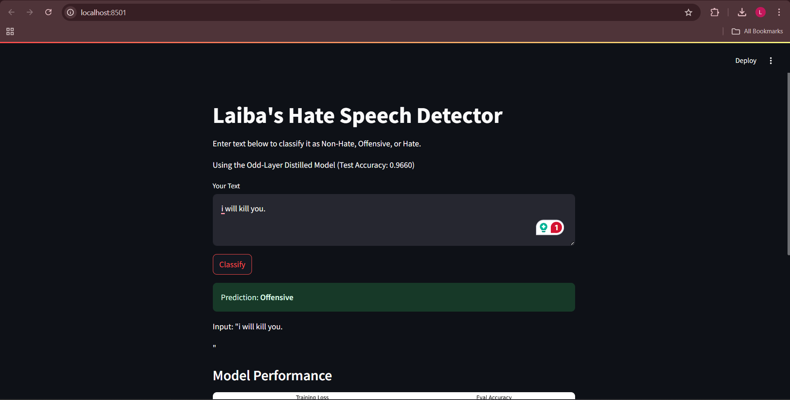
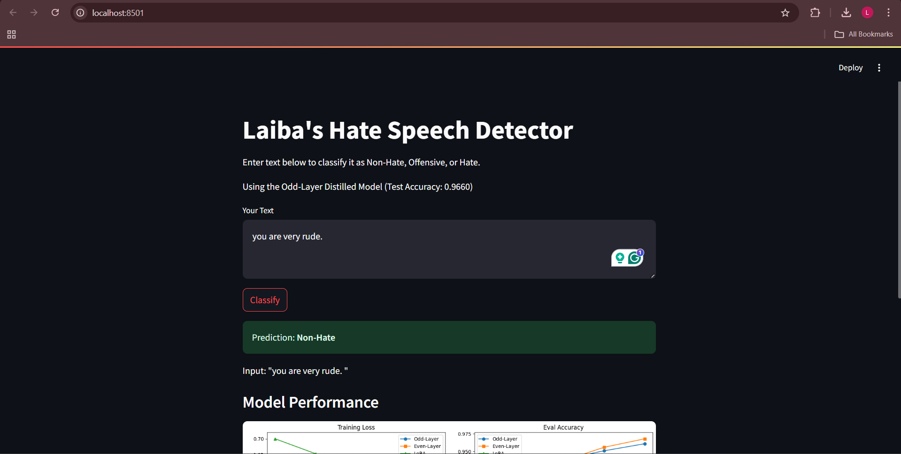

# NLP_st125496_A7
# Hate Speech Classification with BERT Distillation and LoRA


This project implements a hate speech classification system using the "hate_speech_offensive" dataset from Hugging Face. It employs BERT-based models with knowledge distillation and LoRA (Low-Rank Adaptation) techniques to create efficient student models derived from a BERT teacher model. The goal is to compare the performance of distilled models (odd-layer, even-layer) and a LoRA-adapted model against the original teacher model.

## Table of Contents
- [Overview](#overview)
- [Requirements](#requirements)
- [Installation](#installation)
- [Dataset](#dataset)
- [Model Architecture](#model-architecture)
- [Training](#training)
- [Evaluation](#evaluation)
- [Results](#results)
- [Usage](#usage)
- [Saved Models and Tokenizer](#saved-models-and-tokenizer)
- [Contributing](#contributing)
- [License](#license)

## Overview
The project performs the following tasks:
1. Loads and preprocesses the "hate_speech_offensive" dataset.
2. Sets up a BERT teacher model and distills it into two 6-layer student models (odd-layer and even-layer) and a LoRA-adapted student model.
3. Trains the student models using distillation loss (for odd/even) and cross-entropy loss (for LoRA).
4. Evaluates the models on a test set and visualizes training loss and evaluation accuracy.
5. Saves the trained models and tokenizer for future use.

## Requirements
- Python 3.11+
- PyTorch 2.6.0+cu124
- Transformers 4.49.0
- Datasets 3.4.1
- PEFT (Parameter-Efficient Fine-Tuning)
- NumPy, Pandas, Matplotlib, Scikit-learn, TQDM

## Installation
1. Clone this repository:
   ```bash
   git clone https://github.com/yourusername/hate-speech-classification.git
   cd hate-speech-classification
   ```
2. Install the required packages:
   ```bash
   pip install torch transformers datasets peft numpy pandas matplotlib scikit-learn tqdm
   ```
   Note: Ensure your PyTorch version matches your CUDA version if using GPU (e.g., `torch==2.6.0+cu124`).

## Dataset
The dataset used is the ["hate_speech_offensive"](https://huggingface.co/datasets/hate_speech_offensive) dataset from Hugging Face, containing 24,783 tweets labeled as:
- Hate Speech (mapped to label 2)
- Offensive Language (mapped to label 1)
- Neither (mapped to label 0)

For this project:
- Training set: 10,000 samples
- Evaluation set: 1,000 samples (indices 1000-2000)
- Test set: 1,000 samples (indices 2000-3000)

## Model Architecture
- **Teacher Model**: `bert-base-uncased` with 12 layers, fine-tuned for sequence classification (3 labels).
- **Student Models**:
  - **Odd-Layer Student**: 6-layer BERT initialized with odd layers (0, 2, 4, 6, 8, 10) from the teacher.
  - **Even-Layer Student**: 6-layer BERT initialized with even layers (1, 3, 5, 7, 9, 11) from the teacher.
  - **LoRA Student**: 6-layer BERT with LoRA adaptation (r=8, alpha=16, dropout=0.1) applied to `query` and `value` modules.

## Training
- **Distillation**: Odd and even-layer students use a combined loss (cross-entropy + KL divergence + cosine embedding) with a temperature of 2.0.
- **LoRA**: Trained with standard cross-entropy loss (no distillation).
- **Optimizer**: AdamW with a learning rate of 5e-5.
- **Scheduler**: Linear schedule with warmup (0 warmup steps).
- **Epochs**: 5 epochs with a batch size of 32.

## Evaluation
The models are evaluated on a test set of 1,000 samples. Metrics include accuracy, training loss, and evaluation accuracy per epoch.

## Results
### Test Set Accuracy
- **Odd-Layer Student**: 0.9660
- **Even-Layer Student**: 0.9630
- **LoRA Student**: 0.7730

### Training Insights
- Odd and even-layer students outperform the LoRA model in both accuracy and convergence speed, likely due to effective distillation from the teacher.
- LoRA training is faster (1:08 per epoch vs. 2:41 for distilled models) but achieves lower accuracy, suggesting it may require further tuning or more epochs.

### Visualizations
Training loss and evaluation accuracy plots are generated and displayed during execution:
- Odd and even-layer students show steady loss reduction and accuracy improvement.
- LoRA shows slower convergence and lower final accuracy.

## Usage
1. Run the script to train and evaluate the models:
   ```bash
   python hate_speech_classification.py
   ```
2. Load a saved model for inference:
   ```python
   from transformers import BertForSequenceClassification, BertTokenizer

   # Load tokenizer
   tokenizer = BertTokenizer.from_pretrained("tokenizer")

   # Load a model (e.g., odd-layer student)
   model = BertForSequenceClassification.from_pretrained("bert-base-uncased", num_hidden_layers=6, num_labels=3)
   model.load_state_dict(torch.load("student_odd.pth"))
   model.eval()

   # Example inference
   text = "This is a sample tweet."
   inputs = tokenizer(text, return_tensors="pt", max_length=128, truncation=True, padding="max_length")
   outputs = model(**inputs)
   prediction = outputs.logits.argmax(-1).item()
   labels = ["Non-Hate", "Offensive", "Hate"]
   print(f"Prediction: {labels[prediction]}")
   ```

## Saved Models and Tokenizer
- **Models**: Saved as `.pth` files:
  - `student_odd.pth`
  - `student_even.pth`
  - `student_lora.pth`
- **Tokenizer**: Saved in the `tokenizer/` directory with `vocab.txt`, `tokenizer_config.json`, etc.

## Contributing
Feel free to submit issues or pull requests to improve the project. Suggestions for hyperparameter tuning, additional datasets, or alternative distillation methods are welcome!

## License
This project is licensed under the MIT License. See the [LICENSE](LICENSE) file for details.
